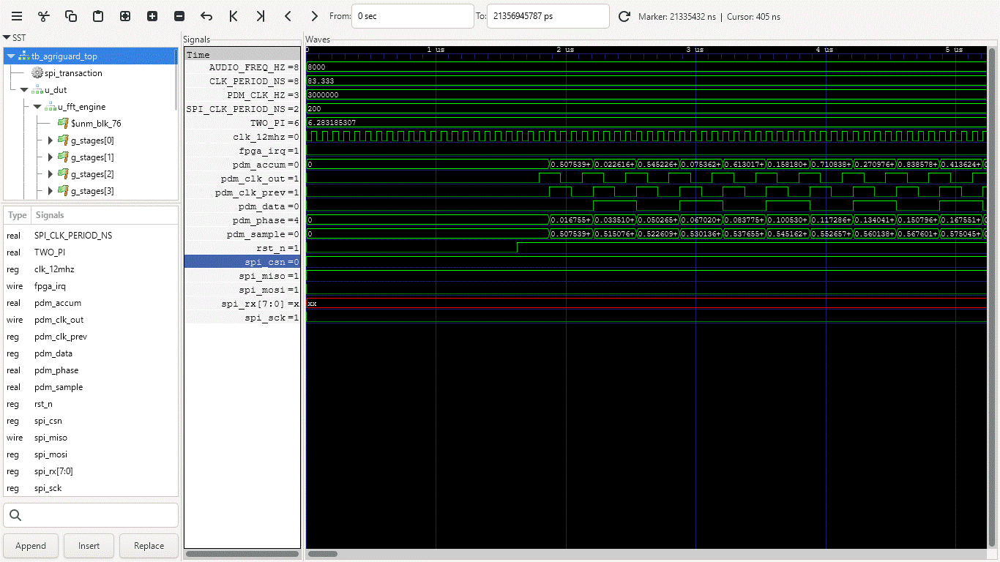
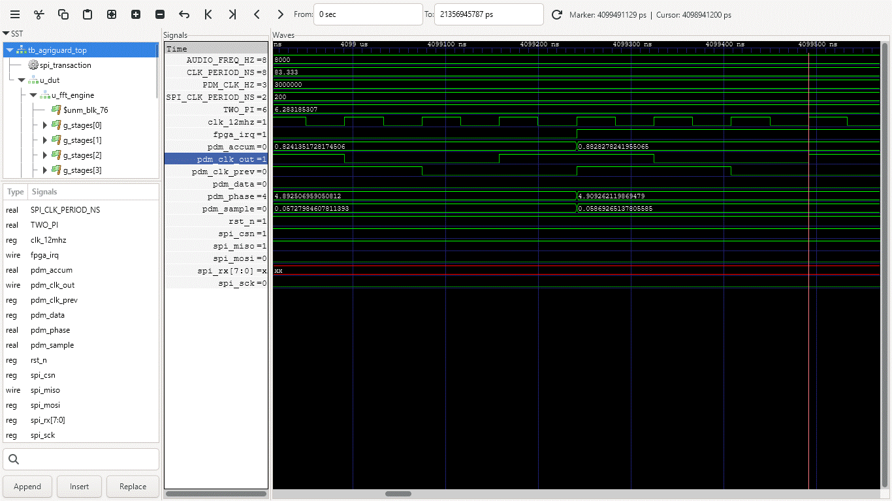
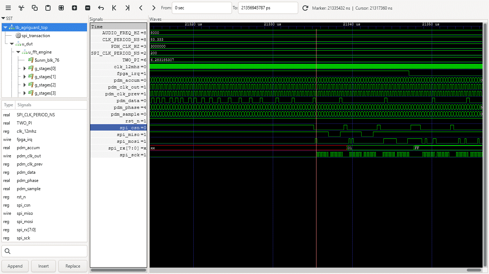

<div align="center">

# AgriGuard-RES
### Reconfigurable Edge Sentinel for Infrastructure-Independent Agricultural Intelligence

<br>


<br>

*Developed by the engineering division at **Agrionics Systems** for next-generation agricultural edge autonomy.*

</div>

---

## Overview

Across Sub-Saharan Africa, over 500 million people depend on smallholder agriculture for survival. In Lesotho, where more than 70% of the population relies on subsistence farming, the convergence of climate variability, invasive pests such as the fall armyworm, and progressive soil degradation threatens food security at a structural level. Annual crop losses range from 20% to 40% — losses that are preventable given the right information at the right time.

Existing precision agriculture platforms fail in this environment because they are engineered for reliable internet and stable grid power. In Lesotho's highlands, where mountain ridges isolate farms and cellular signal is absent for the majority of the day, cloud-dependent IoT architectures are nonfunctional.

**AgriGuard-RES** resolves this architectural limitation by shifting AI inference to the exact source where data originates — in the field, on-device, and in real time.

---

## Table of Contents

1. [System Topology & Hardware Acceleration Architecture](#1-system-topology--hardware-acceleration-architecture)
2. [Sub-GHz Mesh Networking & 6-Layer RF Layout](#2-sub-ghz-mesh-networking--6-layer-rf-layout)
3. [Ultra-Low-Power Solar Harvesting & Power Tree](#3-ultra-low-power-solar-harvesting--power-tree)
4. [Hardware Bring-Up & Quality Verification Procedures](#4-hardware-bring-up--quality-verification-procedures)

---

## 1. System Topology & Hardware Acceleration Architecture


The core innovation of this platform is the hardware co-design of an **STM32H743IIT6** host microcontroller alongside a **Lattice iCE40HX8K FPGA**, implemented on a high-density, impedance-controlled **6-layer PCB substrate**.

```
  ┌────────────────────────┐
  │  ENVIRONMENTAL SENSORS │
  │  (Acoustic, Spectral,  │
  │   Soil RS-485 Modbus)  │
  └──────────┬─────────────┘
             │  raw sensor data
             ▼
  ┌──────────────────────────────┐
  │   Lattice iCE40HX8K FPGA    │
  │  (Parallel Inference         │
  │   Accelerator)               │
  │  FFT · Feature Extraction    │
  │  sub-100 ms latency          │
  └──────────┬───────────────────┘
             │  processed results (SPI)
             ▼
  ┌─────────────────────────┐
  │   STM32H743 HOST MCU    │
  │  (System Orchestration  │
  │   & Power-Gating Logic) │
  └──────────┬──────────────┘
             │  SPI
             ▼
  ┌─────────────────────────┐
  │   SEMTECH SX1262 LoRa   │
  │  (50-Ω Sub-GHz          │
  │   Mesh Transmission)    │
  └──────────┬──────────────┘
             │  RF out → u.fl to SMA
             ▼
```

The 480 MHz ARM Cortex-M7 handles global system orchestration and communication stacks. The Lattice FPGA operates as a **dedicated parallel hardware accelerator** on a split-rail architecture (1.2V Core Logic / 3.3V I/O), executing FFT-based feature extraction and lightweight modulation classification on raw sensor streams with sub-100 ms latency — a computational envelope that software-driven embedded processors cannot match at this micro-power scale.

---

## Functional & Behavioral Verification

The digital twin of the AgriGuard-RES hardware acceleration pipeline has been fully verified via behavioral simulation using `iverilog` and mapped using GTKWave. The simulation tests the end-to-end processing pipeline under a continuous 8 kHz PDM microphone stream containing target acoustic insect frequency signatures.

### Real-Time Behavioral Transitions

The waveforms below are captured directly from the GTKWave VCD output of `tb_agriguard_top.sv`, running all four SystemVerilog cores in a single integrated simulation.

- **System Startup State:**
  

- **Decimator Stabilization:**
  

- **FAW Anomaly Latch Event:**
  

### Timeline & Signal Handshake Sequence

The waveform snapshot captures the critical real-time execution window at the **21.33 ms** mark, validating the cross-chip orchestration:

1. **DSP Front-End Execution:** Continuous clock division on `pdm_clk_out` feeds the MEMS microphone lines, processing noisy sigma-delta modulated `pdm_data` into the 3-stage Cascaded Integrator-Comb (CIC) decimator at a 64:1 decimation ratio (PDM 3 MHz → PCM 48 kHz).
2. **FFT Accumulation:** The core `fft_engine` accumulates 4 sequential spectral frames through an 8-stage Single-path Delay Feedback (SDF) Radix-2 pipeline, running raw bin magnitude calculations to isolate the target Fall Armyworm (FAW) frequency envelope (bins 27–64, corresponding to 5–12 kHz).
3. **Host MCU Interrupt:** At ≈21.31 ms, the hardware detection threshold is crossed, triggering a firm rising edge on the physical `fpga_irq` pin to instantly wake up the STM32 host controller via EXTI13.
4. **SPI Register Extraction:** Following the interrupt assertion, the host MCU pulls `spi_csn` low and drives the `spi_sck` line to interrogate the FPGA register bank.
5. **Telemetry Output:** The data bus (`spi_rx[7:0]`) outputs `0x01` on the ANOMALY register read path, cleanly passing the verified anomaly notification over to the host processor for long-range LoRa mesh propagation.

### Simulation Terminal Results

The following output was captured from a direct `iverilog` + `vvp` execution of the full simulation suite. Terminal output represents logical pass/fail verification — complementing the waveform captures above which show signal-level behavioral correctness.

**PDM Decimator Unit Test** (`tb_pdm_decimator.sv`):
```
[PDM-TB] Applying reset...
[PDM-TB] Reset released
[PDM-TB] TEST 2: DC full-scale input (all 1s)
[PDM-TB]   Last PCM = 0x8000 (-32768)
[PDM-TB] TEST 3: Silence input (alternating 10101...)
[PDM-TB]   Last PCM = 0x0000 (0)
[PDM-TB] TEST 4: 8 kHz sigma-delta sine (48 PCM samples)
[PDM-TB]   PCM[1] = 1151 (0x047f)
[PDM-TB]   PCM[2] = 13405 (0x345d)
[PDM-TB]   PCM[3] = 25463 (0x6377)
[PDM-TB]   PCM[4] = 12688 (0x3190)
[PDM-TB]   PCM[5] = -13423 (0xcb91)
[PDM-TB]   PCM[6] = -25428 (0x9cac)
[PDM-TB] Total valid PCM samples seen: 48
[PDM-TB] PDM decimator test complete
```

**SPI Slave Controller Unit Test** (`tb_spi_slave.sv`) — 8/8 pass:
```
[SPI-TB] TEST 1: STATUS read, faw_detected=0
[SPI-TB] ✓  STATUS_REG: got 0x00

[SPI-TB] TEST 2: STATUS read, faw_detected=1
[SPI-TB] ✓  STATUS_REG bit0: got 0x01

[SPI-TB] TEST 3: faw_pulse fires → fpga_irq latches HIGH
[SPI-TB] ✓  fpga_irq HIGH after faw_pulse: got 1

[SPI-TB] TEST 4: ANOMALY_REG read after faw_pulse
[SPI-TB] ✓  ANOMALY_REG: got 0x01

[SPI-TB] TEST 5: Write CLEAR_IRQ → fpga_irq goes LOW
[SPI-TB] ✓  fpga_irq LOW after clear: got 0

[SPI-TB] TEST 6: ANOMALY_REG reads 0x00 after clear
[SPI-TB] ✓  ANOMALY_REG after clear: got 0x00

[SPI-TB] TEST 7: Threshold write 0xA1=0xCD, 0xA2=0xAB
[SPI-TB] ✓  threshold_out HI: got 0xab
[SPI-TB] ✓  threshold_out LO: got 0xcd

[SPI-TB] Results: 8 passed, 0 failed
```

**Full System Integration Test** (`tb_agriguard_top.sv`) — PDM → FFT → SPI → IRQ end-to-end:
```
[TB] T=0          | Applying reset
[TB] T=1625000    | Reset released
[TB] T=1625000    | Running 4 FFT frames with 8kHz PDM input...
[TB] T=21335129000| fpga_irq = 1 (expect 1 if FAW detected)
[TB] ✓ FAW anomaly detected — IRQ asserted
[TB] T=21339329000| STATUS_REG  = 0x01  (bit0=1 = faw_detected)
[TB] T=21343529000| ANOMALY_REG = 0x01  (expect 0x01 = FAW)
[TB] ✓ ANOMALY_REG correctly reports FAW
[TB] T=21348546000| After IRQ clear: fpga_irq = 0 (expect 0)
[TB] ✓ IRQ cleared successfully
[TB] ══════════════════════════════════════
[TB] AgriGuard-RES HDL simulation complete
[TB] ══════════════════════════════════════
```

> **Reproduce locally:**
> ```bash
> # Requires OSS CAD Suite (Yosys + nextpnr-ice40 + iverilog + GTKWave)
> cd HDL_FPGA
> make sim        # compile + run full system testbench
> make wave       # open waveforms in GTKWave
> ```

### Multi-Seasonal Dynamic Reconfigurability

The FPGA is fully field-reconfigurable. Multiple AI bitstreams are stored non-volatilely on an onboard **128 Mb Winbond W25Q128JVS Serial NOR Flash** chip. The host MCU reloads bitstreams on-demand via the dedicated SPI configuration path, switching the sentinel's operational profile across agricultural seasons without a single hardware modification.

| Pipeline | Sensor Modality | Function |
|---|---|---|
| **Acoustic Pest Pipeline** | Digital MEMS Microphone | FPGA-accelerated hardware FFT; isolates insect chewing frequency signatures before infestations become visible |
| **Spectral Crop Pipeline** | Multi-channel NIR Sensor | Fuses NIR telemetry to compute vegetation indices; detects crop water-stress and cellular decay before leaf symptoms manifest |
| **Soil Intelligence Pipeline** | RS485 Modbus Probe + BME680 | Interfaces with five-parameter soil probes and microclimate sensors; compiles localised fertility and irrigation profiles |

---

## 2. Sub-GHz Mesh Networking & 6-Layer RF Layout

To bypass mountain topography barriers, AgriGuard-RES transmits **only actionable edge decisions** — not raw sensor data — over a sub-GHz **Semtech SX1262 LoRa mesh network**. The **433 MHz band** was selected for its superior ground-wave propagation and knife-edge diffraction characteristics across rugged highland terrain — lower frequency means longer wavelength, directly translating to enhanced penetration through vegetation density gradients and around rocky ridgelines in Lesotho's Maluti Mountain range, achieving **5 to 15 kilometres per hop**.

To guarantee that high-speed digital transitions from the FPGA configuration bus do not desensitise the radio receiver front-end, the physical board uses a **6-layer impedance-controlled stack-up**.

### PCB Layer Stack-Up

| Layer | Functional Domain | Copper Profile |
|---|---|---|
| **Layer 1 — Top** | High-Speed RF / Signal | Straight 50-Ω Coplanar Waveguide, TX Switch, Matching Networks |
| **Layer 2 — Int 1** | Shield Plane | Solid, unbroken ground return path (GND) |
| **Layer 3 — Int 2** | Inner Signal | MCU breakout, dense SPI configuration buses |
| **Layer 4 — Int 3** | Power Domain | Split copper rails: `+3V3`, `+1V2` FPGA core, always-on lines |
| **Layer 5 — Int 4** | Auxiliary Plane | Secondary solid reference ground plane (GND) |
| **Layer 6 — Bottom** | Low-Speed Signal | Sensor tracking, FPGA backside decoupling capacitor networks |

### RF Layout Constraints

**Straight-Line RF Mandate**
The antenna trace travels in a perfectly straight, horizontal line on Layer 1 from the SX1262 output, through the passive Pi-network filter, across the RF switch pins, into the U.FL antenna port. Vias, corners, and trace bends are strictly prohibited on the RF line to prevent impedance discontinuities.

**Faraday Shield Wall**
The top-layer coplanar ground plane running parallel to the RF trace is stitched directly into the Layer 2 ground plane via shielding vias spaced at **1.5 mm to 2.0 mm** increments, forming a continuous electromagnetic barrier that traps radio emissions and prevents coupling into adjacent signal layers.

**USB 2.0 Differential Pair**
The `USB_D+` and `USB_D−` debug lines are routed as a uniform parallel track (`0.15 mm width / 0.15 mm gap`) over the solid Layer 2 GND mirror, enforcing a rigid **90-Ω differential impedance** profile.

---

## 3. Ultra-Low-Power Solar Harvesting & Power Tree

Perpetual, unattended field operation through harsh highland winters and extended overcast periods requires an ultra-low-power standby configuration targeting **under 50 µA in deep sleep**.

### Subsystem Breakdown

**Harvester Core — ADP5090**

Dynamically tracks maximum power via an optimised **70% MPPT ratio** using a multi-mega-ohm network (`R23 = 6.34 MΩ`, `R24 = 14.7 MΩ`) to eliminate passive divider leakage current. Charge termination (`TERM`) is locked at **5.0 V** to saturate the primary supercapacitor reservoir.

**Dual-Priority Backup Rail**

A dual CR2032 coin-cell pack in series (6.0 V nominal), protected inline via a low-drop 1N4148 Schottky diode, steps the backup entry line down to **5.3 V** to respect the harvester's maximum silicon input limit.

**Always-On Sleep Rail — LMZM23600V3**

Draws a mere **28 µA** under zero-load conditions. Pin 4 (`EN`) is tied to `VIN_MAIN`; Pin 2 (`MODE/SYNC`) is grounded to enforce **Auto PFM burst-switching mode**, maintaining the persistent STM32 memory domains during deep standby.

**Active 3.3 V Main Rail — TPS563300**

Supervised by a rigid resistor network (`R1 = 590 kΩ`, `R2 = 169 kΩ`) targeting a **5.0 V startup threshold** and a **4.0 V safety shutdown barrier**, preventing brownout crashes. Power-gates the peripheral sensors, transceiver, and FPGA I/O banks.

**Active 1.2 V FPGA Core Rail — TPS62932**

Uses the chip's native internal **0.8 V reference** with an optimised E96 1% divider (`R_fbt = 5.1 kΩ`, `R_fbb = 10.2 kΩ`), producing a mathematically exact **1.200 V** core rail. Pin 1 (`RT`) is grounded, forcing a compact **1.2 MHz switching loop** paired with a **2.2 µH low-profile inductor** to suppress control-loop ripple.

### Power Rail Summary

| Rail | Regulator | Target Output | Condition |
|---|---|---|---|
| Always-On Sleep | LMZM23600V3 | 3.30 V | 28 µA quiescent; Auto PFM |
| Active Main | TPS563300 | 3.30 V | Startup at 5.0 V; shutdown at 4.0 V |
| FPGA Core | TPS62932 | 1.200 V | 1.2 MHz switching; `RT` = GND |
| Backup Entry | CR2032 × 2 + 1N4148 | ~5.3 V | Series pair; Schottky-clamped |

---

## 4. Hardware Bring-Up & Quality Verification Procedures

Execute these diagnostic procedures on unpopulated or newly assembled hardware **before** connecting any active power source or debug probe.

### Phase A — Isolation Checks (Continuity Diagnostic)

Set a digital multimeter to **Continuity / Resistance Mode** and verify power rail isolation across the 6-layer plane splits.

1. Measure between `+3V3` and `GND`. Confirm the resistance climbs into the kilo-ohm range as the 0603 decoupling arrays charge.
2. Measure between `+1V2` and `GND`. Verify the internal FPGA core logic plane is completely isolated.
3. Confirm that the centre grounding pad tap of the high-speed clock crystal load capacitors (`C50` / `C51`) maintains direct, low-impedance continuity to the primary system ground layer.

### Phase B — Power-Up Verification (Voltage & Signal Loop Diagnostics)

1. Apply **5.0 V** from a current-limited bench supply (**50 mA ceiling**) to the solar terminal block `J3`.
2. Confirm the **LMZM23600V3** outputs a clean, stable **3.30 V** always-on rail to the MCU standby domains.
3. Verify the **TPS62932** output sits within the FPGA core operating tolerance window — **1.14 V to 1.26 V**.
4. Connect a PC via USB-C to debug port `J7`. Confirm that the Configuration Channel pins (`CC1` / `CC2`) register a clean voltage drop across their independent **5.1 kΩ resistors**, signalling the host machine to deliver a standard 5 V VBUS rail to sensing pin `PA9`.

---

<div align="center">

**Agrionics Systems** — Engineering Division

*Precision at the edge. Intelligence in the field.*

</div>

